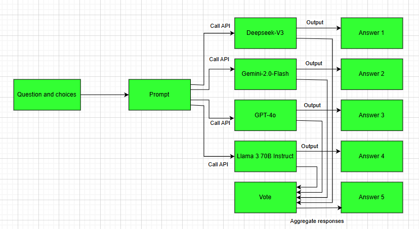

# Multi Large Language Model Code Solver

## Project Description

### 1. Purpose, Input Data Requirements, and Output Requirements
The project aims to evaluate the programming comprehension and reasoning abilities of AI models using the CodeMMLU dataset (multiple-choice programming questions). The input data consists of questions and choices, while the output is a file containing question identifiers (task_id) and selected answers (A, B, C, or D).

### 2. Method Description
The methodology consists of four steps:  
- Construct standardized prompts from questions and choices.  
- Query four AI models (DeepSeek-V3, Gemini 2.0 Flash, GPT-4o, Llama 3 70B Instruct) in parallel via API in batches of 5–10 questions, with error-handling mechanisms.  
- Validate responses to ensure they follow the single-character format (A, B, C, D).  
- Aggregate results using majority voting, selecting the most frequent answer or applying confidence-weighted voting if no clear majority exists.

The overall workflow is illustrated in the diagram below:

### 3. Results Description

| **Model**              | **API Source**   | **Accuracy Score** |
|------------------------|------------------|---------------------|
| GPT-4o                 | OpenAI           | 0.70                |
| DeepSeek-V3            | OpenRouter       | 0.75                |
| Gemini-2.0-Flash       | Google AI        | 0.72                |
| Llama 3 70B Instruct   | Together AI      | 0.62                |
| Voting Ensemble        | Combination      | 0.71                |

**Table:** Comparative model performance on CodeMMLU benchmark
